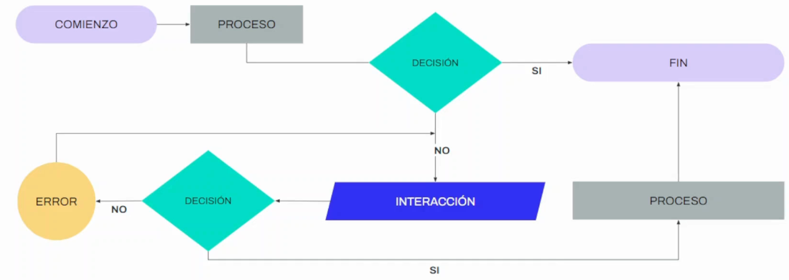

# MODELO MENTAL

Es una representación abstracta de cómo funciona algo.

Los usuarios construyen su propio modelo mental que está basado en experiencias previas o en su conocimiento de estándares generalizados.
  

---

## Aprendizaje

Se desarrolla en 2 pasos:

FASE DE ASIMILACIÓN en la que se absorbe la información y la FASE DE CONSTRUCCIÓN en la que se crea el modelo mental

Para facilitar el aprendizaje al máximo se recomienda implementar:

- El uso de estándares
- La aplicación de reglas
- La limitación de la carga cognitiva

---

## Atención

Nos permite decidir en qué información nos concentramos.

Es fundamental que de un solo vistazo se entienda cómo funciona el sistema destacando los elementos de acción más importantes.

---

## Memoria

Se encarga de recopilar información, procesarla, organizarla y recuperarla para llevar a cabo una tarea.

- **A corto plazo**: permite recordar pequeños ítems de información en un periodo corto de tiempo. Ayuda a tomar decisiones. Se aconseja acotar las opciones que se disponibilizan.
- **A largo plazo**: almacena grandes cantidades de información durante largos períodos. Hay que fomentarla para no forzar al usuario a que deba aprender desde cero como usar el producto.

---

## Arquitectura de la información (AI)

La arquitectura de la información nos ayuda a desarrollar los cimientos de nuestro producto digital.

Necesitaremos representar la primera capa no tangible de interacción que respeta el modelo mental de nuestros usuarios.

**Objetivo** ➔ Permitir a los usuarios encontrar su vía de navegación hacia el conocimiento y la comprensión de la información.

---

## Ejemplos en lo cotidiano

- Sistemas alfabéticos de referencia utilizados en un diccionario
- Links en la navegación de un sitio web
- Secciones, subsecciones y nombres de los platos en el menú de un restaurante
- Categorías, etiquetas y tareas de un software o una app
- La señalética de un aeropuerto para guiar pasajeros

---

## AI - Estructuración y organización

- Debe determinar los contenidos, las funcionalidades del producto y facilitar el acceso.
- Los sistemas de organización, búsqueda y navegación son los que ayudan a los usuarios.
- ¿De dónde aparece la información y los datos con la que construimos la Arquitectura de la información?

---

## Realización de la AI

### Organización

Destinado a categorizar los contenidos y la información.

El objetivo primordial es permitir al usuario que sea capaz de intuir dónde estará el contenido al que desee acceder.

- Alfabéticamente
- Cronológicamente
- Tema
- Audiencia

### Etiquetado

Definir la terminología (etiquetas) con la que vamos a agrupar los conjuntos que sean similares de información.

---

## Navegación

Definir una estructura y componentes para ayudar al usuario a desplazarse a través de un flujo de acceso al contenido.

- Navegación jerárquica
- Navegación lineal
- Navegación en red
- Navegación de hipertexto

---

## Búsqueda

Generar un sistema de organización o motor de búsqueda a través de filtros, recomendaciones, palabras, etc.

---

## Ventajas de usar AI

- Garantiza que el contenido está donde el usuario espera encontrarlo.
- Ayuda a organizar el contenido de nuestro producto digital.
- Permite calcular el tamaño y el contenido que podemos necesitar.
- Nos aseguramos de no olvidar incluir información y elementos.

---

## Arquitectos de la información

Diseñadores que identifican expectativas, determinan contenidos, facilitan accesos y planifican a futuro.
  

  
# Tree Testing
Herramienta para probar el árbol de navegación de un sitio web o app.

Indica si es fácil encontrar información clave y si se pierden los usuarios en el intento.

### Preguntas clave:
- ¿Las etiquetas tienen sentido para la gente?
- ¿La forma en que se agrupa ese contenido es lógica para las personas?
- ¿Pueden encontrar la información que buscan rápidamente? ¿Qué los detiene?

---

## ¿Cómo son las pruebas?
- Es una versión solo texto de la estructura de la app o sitio.
- Se crean una serie de tareas para que las completen los participantes.
- Los participantes deben seleccionar ubicaciones en el árbol donde esperan encontrar la respuesta.

---

## ¿Qué aprendemos?
1. Cuántas personas llegaron al destino correcto y cuántas no.
2. Cuántas personas se perdieron en el camino.
3. Los caminos que tomaron las personas antes de llegar a su destino previsto.
4. Cuánto tiempo les llevó completar la tarea.

---

# Card Sorting
Técnica de investigación que ayuda a descubrir cómo las personas entienden y clasifican la información.

### Descripción:
- Implica crear un conjunto de tarjetas (con texto o imágenes) que representan un concepto o elemento y pedir a las personas que las agrupen.
- **Se prueban conceptos, no usabilidad.**

---

## ¿Cuándo es útil?
- Diseñar un nuevo producto o modificar/mejorar uno que existe.
- Descubrir cómo esperan ver la información los usuarios.
- Comparar cómo entienden diferentes conceptos.
- Hacer que los usuarios organicen elementos según criterios establecidos.

---

## ¿Qué tipos de Card Sorting hay?
1. **Card sorting ABIERTO**:
   - Los participantes clasifican las tarjetas en grupos que tengan sentido y etiquetan cada grupo ellos mismos.
   - Este enfoque es el equivalente a una pregunta abierta en un estudio tradicional.

2. **Card sorting CERRADO**:
   - Los participantes clasifican las tarjetas en grupos que los diseñadores ya les damos definidos de antemano.

3. **Card sorting HÍBRIDO**:
   - Los participantes clasifican las tarjetas en grupos ya otorgados a priori y también pueden crear sus propios grupos.

---

# User Flow
Es una representación abstracta de cómo funciona algo. Una representación gráfica del diálogo entre la persona y el sistema.

---

## User Flow - Descripción
- Se utiliza en los primeros momentos de la etapa de prototipado para definir el camino que debe hacer el usuario en su interacción con el producto.
- Los flujos de usuario se basan en entender los objetivos que generan una experiencia de uso positiva, logrando un mejor resultado tanto para los usuarios como para el negocio.
- Ayudan a determinar los trayectos más comunes e identificar áreas conflictivas, reduciendo la fricción.

### A tener en cuenta:
- Existen muchos tipos de personas, con diferentes conocimientos sobre el producto y distintos objetivos. 
- Los flujos deben enfocarse para impactar a la mayor cantidad de usuarios posibles.

---

# Taskflow (Diagrama de tareas)
- Se enfoca en las tareas que tiene que realizar el usuario en cada paso para llegar a un objetivo.
- Describe cómo los usuarios viajan a través de la app o web mientras realizan una tarea específica.
- **Por lo general, sólo muestra una ruta y no incluye múltiples ramas o rutas como lo haría un flujo de usuario tradicional.**

---

# Flowchart (Diagrama de flujo)
- Representación gráfica de un proceso que refleja la secuencia de pasos y decisiones necesarias para realizar un proceso.
- Permite identificar el trayecto o proceso que realizan diferentes usuarios para completar todas las tareas posibles que admita el sistema.

---

### Características:
- Cada paso en la secuencia se agrega dentro de una forma en el diagrama.
- Los pasos están vinculados mediante líneas de conexión y flechas direccionales.

---

# Beneficios del User Flow
- Crear una interfaz intuitiva.
- Evaluar una interfaz que ya existe.
- Buena comunicación con los equipos.
- Ejecutar iteraciones rápidas.
